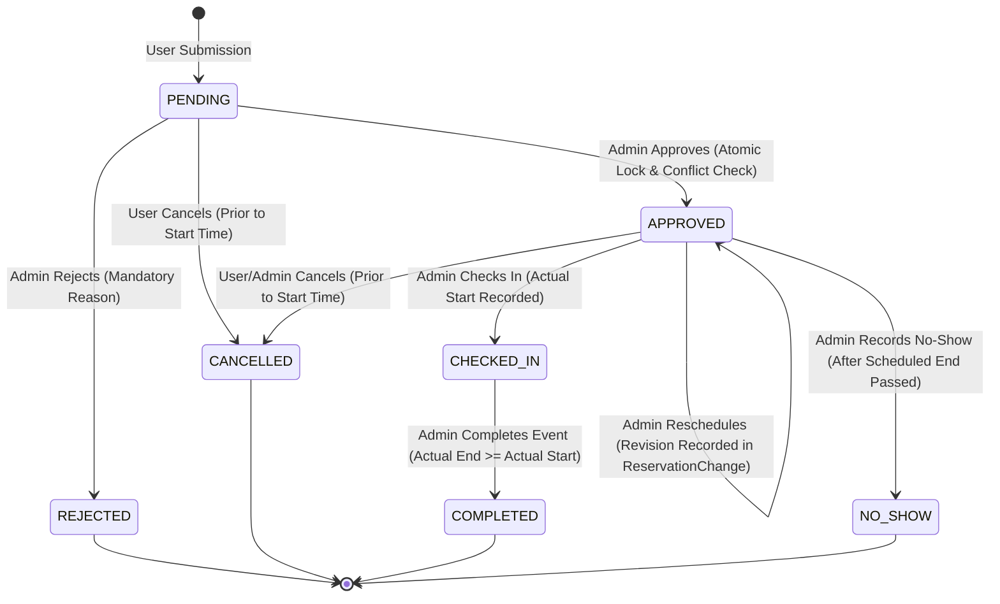
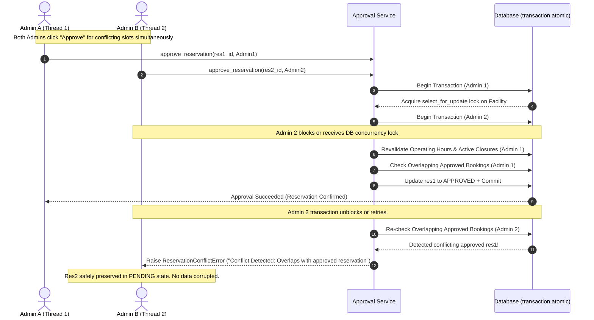
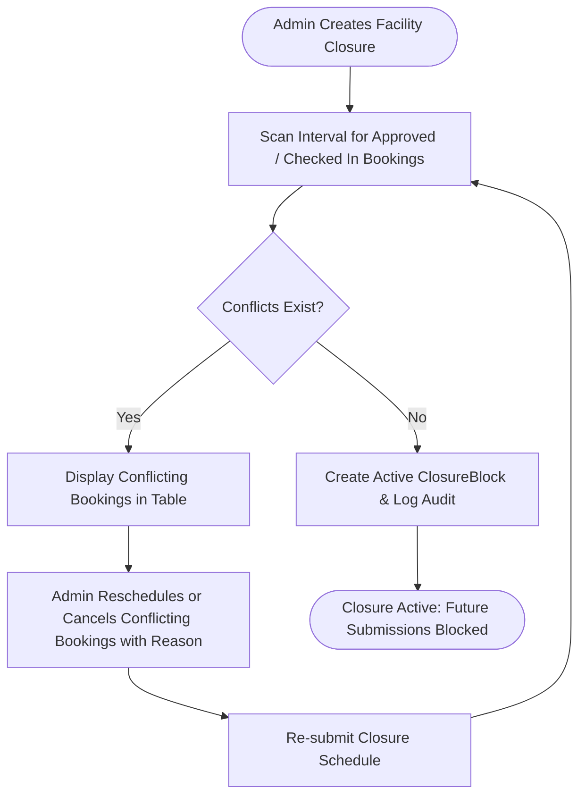

# Workflow Diagrams & State Machine

## 1. Reservation State Machine

```mermaid
stateDiagram-v2
    [*] --> PENDING: User Submission

    PENDING --> APPROVED: Admin Approves (Atomic Lock & Conflict Check)
    PENDING --> REJECTED: Admin Rejects (Mandatory Reason)
    PENDING --> CANCELLED: User Cancels (Prior to Start Time)

    APPROVED --> CHECKED_IN: Admin Checks In (Actual Start Recorded)
    APPROVED --> NO_SHOW: Admin Records No-Show (After Scheduled End Passed)
    APPROVED --> CANCELLED: User/Admin Cancels (Prior to Start Time)
    APPROVED --> APPROVED: Admin Reschedules (Revision Recorded in ReservationChange)

    CHECKED_IN --> COMPLETED: Admin Completes Event (Actual End >= Actual Start)

    REJECTED --> [*]
    CANCELLED --> [*]
    COMPLETED --> [*]
    NO_SHOW --> [*]
```

## 2. Atomic Concurrency Approval Flow

```mermaid
sequenceDiagram
    autonumber
    actor Admin1 as Admin A (Thread 1)
    actor Admin2 as Admin B (Thread 2)
    participant Service as Approval Service
    participant DB as Database (transaction.atomic)

    Note over Admin1, Admin2: Both Admins click "Approve" for conflicting slots simultaneously
    Admin1->>Service: approve_reservation(res1_id, Admin1)
    Admin2->>Service: approve_reservation(res2_id, Admin2)

    Service->>DB: Begin Transaction (Admin 1)
    DB-->>Service: Acquire select_for_update lock on Facility

    Service->>DB: Begin Transaction (Admin 2)
    Note over DB, Admin2: Admin 2 blocks or receives DB concurrency lock

    Service->>DB: Revalidate Operating Hours & Active Closures (Admin 1)
    Service->>DB: Check Overlapping Approved Bookings (Admin 1)
    Service->>DB: Update res1 to APPROVED + Commit
    DB-->>Admin1: Approval Succeeded (Reservation Confirmed)

    Note over DB, Admin2: Admin 2 transaction unblocks or retries
    Service->>DB: Re-check Overlapping Approved Bookings (Admin 2)
    DB-->>Service: Detected conflicting approved res1!
    Service-->>Admin2: Raise ReservationConflictError ("Conflict Detected: Overlaps with approved reservation")
    Note over Admin2: Res2 safely preserved in PENDING state. No data corrupted.
```

## 3. Facility Closure Conflict Workflow

```mermaid
flowchart TD
    Start([Admin Creates Facility Closure]) --> Check[Scan Interval for Approved / Checked In Bookings]
    Check --> Overlap{Conflicts Exist?}
    Overlap -- No --> Commit[Create Active ClosureBlock & Log Audit]
    Overlap -- Yes --> Block[Display Conflicting Bookings in Table]
    Block --> Action[Admin Reschedules or Cancels Conflicting Bookings with Reason]
    Action --> Recheck[Re-submit Closure Schedule]
    Recheck --> Check
    Commit --> End([Closure Active: Future Submissions Blocked])
```
